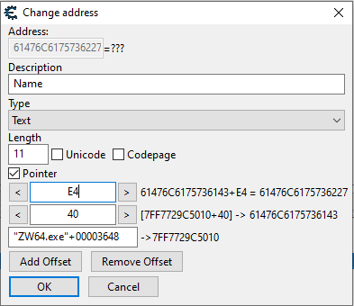

# Overview

## About The Project

Helper library for external windows game hacking.

Collaborative work provided by the <a href="https://discord.gg/CRMQq4F" target="_blank">CasualCommunity</a>

## Installation

 1. Download current release ("CasualLibrary1.0.rar") from <a href="https://github.com/CasualCoder91/CasualLibrary/releases/" target="_blank">the release section</a>
 2. Extract *.h and *.lib file(s) at appropriate location in your project directory.
 3. Include them into your project.

## Build from source

If You want or need to build the project from source, You can either
 1. Download the whole repository
 2. Open the VS project (CasualLibrary.sln) with Visual Studio
 3. Right click the CasualLibrary and hit build

Or use cmake
1. Create new folder in the projects root directory: ```mkdir build```
2. Navigate to the new folder: ```cd build```
3. Run cmake: ```cmake ..```
4. Build: ```cmake --build .```
   (tested with "Visual Studio 16 2019" and "GNU 6.3.0"/"MinGW Makefiles")


<!---## Documentation

The main set of documentation can be found <a href="https://casualcoder91.github.io/CasualLibrary/html/index.html" target="_blank">here</a>--->
## Usage

### bare-bones setup

#### external

```cpp
#include <iostream>
#include "CasualLibrary.hpp"

int main(){
    Memory::External memory = Memory::External("target.exe");
    Memory::External memoryDebug = Memory::External("target.exe", true); //use for debug messages
}
```

#### internal

<details>
  <summary>Sample dll including the library</summary>

  ```cpp
  #include <Windows.h>
  #include <iostream>

  #include "CasualLibrary.hpp"

  HMODULE myhModule;

  DWORD __stdcall EjectThread(LPVOID lpParameter) {
      Sleep(100);
      FreeLibraryAndExitThread(myhModule, 0);
  }

  DWORD WINAPI Menue() {
      AllocConsole();
      FILE* fp;
      freopen_s(&fp, "CONOUT$", "w", stdout); // output only
      std::cout << "Running tests ...\n\n";

      //add Code here

      while (1) {
          Sleep(100);
          if (GetAsyncKeyState(VK_NUMPAD0))
              break;
      }
      fclose(fp);
      FreeConsole();
      CreateThread(0, 0, EjectThread, 0, 0, 0);
      return 0;
  }


  BOOL APIENTRY DllMain(HMODULE hModule,
      DWORD  ul_reason_for_call,
      LPVOID lpReserved
      )
  {
      switch (ul_reason_for_call)
      {
      case DLL_PROCESS_ATTACH:
          myhModule = hModule;
          CreateThread(NULL, 0, (LPTHREAD_START_ROUTINE)Menue, NULL, 0, NULL);
      case DLL_THREAD_ATTACH:
      case DLL_THREAD_DETACH:
      case DLL_PROCESS_DETACH:
          break;
      }
      return TRUE;
  }
  ```

</details>

### read/write memory

#### external

```cpp
//works for all types including uintptr_t, int, double etc. as well as custom structs and classes.
//does NOT work for arrays/vectors
Address address = Address(0x2240001C);
// read integer stored at address
int test = memory.read<int>(address);
// read string
std::string word = memory.read<std::string>(address);
//write value 5 starting at given address
memory.write<int>(address, 5);
//To check the memory before accessing it set memoryCheck = true
int testSave = memory.read<int>(address, true);
memory.write<int>(address, 5, true);
```

#### internal

```cpp
//works for all types including uintptr_t, int, double etc. as well as custom structs and classes.
//does NOT work for arrays/vectors
Address address = Address(0x2240001C);
// read integer stored at address
int test = Memory::Internal::read<int>(address);
// read string
std::string word = Memory::Internal::read<std::string>(address);
//write value 5 starting at given address
Memory::Internal::write<int>(address, 5);
//To check the memory before accessing it set memoryCheck = true
int testSave = Memory::Internal::read<int>(address, true);
Memory::Internal::write<int>(address, 5, true);
```

### get module base address

#### external

```cpp
Address clientAddr = memory.getModule("client.dll");
```

#### internal

```cpp
Address clientAddr = Memory::Internal::getModule("client.dll");
```

### get address from static pointer + offsets



#### external

```cpp
Address baseAddr = memory.getModule("ZW64.exe");
Address healthAddr = memory.getAddress(baseAddr+0x00003648, { 0x40,0xE4 });
```

#### internal

```cpp
Address baseAddr = Memory::Internal::getModule("ZW64.exe");
Address healthAddr = Memory::Internal::getAddress(baseAddr+0x00003648, { 0x40,0xE4 });
```

### AOB Scanner

#### external

```cpp
Address address = memory.findSignature(0x7FF702CB5D00, "? 39 05 F0 A2 F6 FF" , 10000);
```

#### internal

```cpp
Address address = Memory::Internal::findSignature(0x7FF702CB5D00, "? 39 05 F0 A2 F6 FF" , 10000);
```
